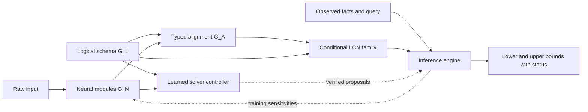

# Neural Logical Credal Networks

Detailed research plan — 29 September 2026.
Repository baseline: `e4806084205bf1176b142869ab6926318a0c6823`.

This document proposes a neuro-symbolic architecture that combines neural
networks with logical credal networks (LCNs). It covers semantics, neural and
logical structure, marginal inference, differentiable learning, experiments,
and a staged implementation program. Algorithms and theorems labeled as targets
are proposed work, not completed results. The focused literature review and
source-verification notes are in [references.md](references.md).

The [LCN learning plan](../research-learning/research-plan.md),
[global Markov condition plan](../research-gmc/research-plan.md), and
[MAP search plan](../research-map-lcn/research-plan.md) supply complementary
research directions. This proposal adds neural perception, explicit connections
between neural and logical structure, and inference over the resulting coupled
uncertainty. It does not assume those earlier plans have been implemented.

## 1. Objective and intended contributions

Develop **Neural Logical Credal Networks (NLCNs)**: conditional families of
probability distributions specified jointly by neural modules, logical
probability assessments, and an explicit Markov interpretation. Given raw input,
observed facts, and a logical query, an NLCN should return lower and upper
probabilities, an explanation of relevant constraints, and the numerical status
of each bound.

The architecture should support more than a neural classifier followed by a
fixed symbolic engine. Logical scopes should guide neural module organization;
neural modules should predict compatible assessments over atoms and formulas;
query losses should train neural parameters through a reasoning layer; and
structure learning should choose neural sharing, logical rules, and their
connections together. A learned inference controller can accelerate reasoning
without becoming the source of its correctness guarantees.

The central research question is:

> Can a jointly structured neural–LCN model express uncertainty that precise
> neuro-symbolic models miss, while retaining useful, certified inference and
> learning procedures on explicitly characterized fragments?

Neural probabilistic logic, neural logical rule learning, and neural credal
prediction already exist [N5–N13, N18–N20, N27, N28]. Probabilistic circuits
already connect tractability with logical structure, and credal circuits already
support selected lower/upper queries [N14–N17, N30, N31]. The proposed work should
therefore pursue the following narrower contributions:

1. **A typed neural–LCN interface and formal semantics.** Represent neural
   assessments, shared uncertainty, logical constraints, and Markov assumptions
   without silently replacing one by another.
2. **Joint architecture learning.** Search neural computation, logical sentence
   structure, and their alignment under predictive, uncertainty, and inference
   budgets. Investigate when concept grounding is identifiable.
3. **Certified neural-assisted inference.** Combine exact small-model inference,
   coupled region relaxations, and verified neural proposals; return separate
   bounds on both credal endpoints.
4. **Conditional credal circuit fragments.** Characterize precisely which NLCNs
   admit reusable circuit compilation and which queries remain tractable when
   neural outputs change with the input.
5. **Differentiable set-valued learning and composed robustness.** Train useful
   representatives and uncertainty sets, and investigate sound propagation of
   input/weight uncertainty through both neural and logical components.

A successful first paper need not solve all five. Its minimum result should be
a precise model definition, an independently checked inference algorithm, and
evidence that preserving dependence improves uncertainty quality on tasks where
independent neural concept heads fail. A second paper can target joint structure
learning and tractable fragments.

## 2. Literature map and research positioning

| Research line | Established result or design | Implication for this proposal |
| --- | --- | --- |
| LCNs and Markov theory [N1–N4] | Logical probability assessments, graph-derived independencies, chain and directed–undirected mixed-graph factorizations | Neural integration must select a distribution family and preserve its constraints. |
| DeepProbLog [N5] | Neural predicates, probabilistic logic, circuit-based inference, end-to-end gradients | Joint neural/logical training is an established baseline; extend precise assessments to coupled credal sets. |
| NeurASP and SLASH [N6, N8] | Neural outputs combined with answer-set semantics; SLASH also integrates probabilistic circuits | Compare on matched tasks, while recording differences between stable-model and LCN world semantics. |
| DeepStochLog [N7] | Neural stochastic logic over derivations | Its efficient inference is not automatically applicable to probabilities over LCN worlds. |
| Logical Neural Networks and Logic Tensor Networks [N9, N10] | Formula-aligned computation, real-valued logical reasoning, differentiable constraints | Borrow architectural organization; truth degrees and truth bounds are not probability assessments. |
| Semantic loss and Semantic Probabilistic Layers [N11, N12] | Knowledge-guided neural training; normalized structured distributions constrained by logic | SPL is a close precise predecessor that already handles correlated labels and hard logical support. |
| Conditional probabilistic circuits [N13, N30, N31] | Input-conditioned parameters and tractable structured computation | Neural conditioning itself is not new; robust optimization over coupled parameter sets is the added problem. |
| Credal SPNs, CSDDs, and their learning [N14–N16] | Local credal parameters, logical support, selected exact bounds, learned structures | Reusing interval weights alone is insufficient novelty; identify an LCN representation theorem and query contract. |
| Constrained circuit robustness [N17] | Preserve shared parameters in compilation, then relax them for sound bounds | Direct predecessor for dependency-preserving compilation and controlled relaxation. |
| Credal neural prediction [N18–N20] | Sets of neural predictive distributions, interval networks, credal GNNs | Uncertainty heads are components and baselines, not by themselves a new NLCN architecture. |
| Differentiable optimization and learned solver policies [N21, N23] | Gradients through suitable convex programs; learned branching choices | Separate differentiable model fitting from verified global inference. |
| Concept grounding and reasoning shortcuts [N25, N26, N29] | Correct labels need not imply correct concepts; independence restricts uncertainty over explanations | Evaluate concept meaning, dependence, and interventions alongside task accuracy. |
| Neural LP and differentiable ILP [N27, N28] | Differentiable rule structure and parameter learning | Extend structure search to credal logical assessments and neural alignment, not just soft rule selection. |

Three comparisons are especially important. First, SPL already multiplies a
neural-conditioned probabilistic circuit by a compatible constraint circuit and
normalizes it. Its compatibility theorem does not imply tractability of extrema
over arbitrary credal parameter sets. Second, CSDDs already combine logical
support and credal parameters; posterior tractability depends on topology and
support assumptions. Third, recent shortcut analysis [N26] formally identifies
limitations of conditionally independent concept predictions. NLCNs should be
tested on these limitations, without claiming that uncertainty sets alone solve
concept identifiability.

This is a focused review of foundations and close predecessors, including
selected 2024–2025 work, rather than an exhaustive priority search. Before a
submission, update the review for neural probabilistic programming, credal
circuits, differentiable inference, and neuro-symbolic uncertainty.

## 3. Formal model: three structures and one distribution family

### 3.1 Initial scope

Begin with a finite set of discrete atoms $V$, raw observed input $x$ (images,
features, or sensor readings), and optional logical evidence $e$. Let $Q$ be a
Boolean query over $V$. Initially, $x$ is a conditioning context: we model
$P(V\mid x)$, not a generative density over images. Parameters learned across
examples are fixed during ordinary prediction. First-order templates can later
generate finite ground instances, with grounding cost counted explicitly.

Keep the following structures separate:

- $G_N$: neural computation graph, including encoders, group heads, parameter
  sharing, and any schema-conditioned modules.
- $G_L$: logical sentence schema, annotations, hard support constraints, and
  the graph/Markov semantics induced by that schema.
- $G_A$: typed alignment graph connecting neural outputs to atoms, formulas,
  conditional assessments, local tables, and shared uncertainty variables.

An edge in $G_N$ expresses computation; an edge in $G_L$ participates in a
probabilistic structural interpretation; an edge in $G_A$ specifies how a neural
quantity enters that interpretation. None is automatically a substitute for the
others. Two heads with a shared deterministic encoder need not define independent
random variables, but parameter sharing at fixed $(x,\theta)$ also does not by
itself create an additional probabilistic factor.

### 3.2 Conditional LCN semantics

Let $S=\{(\phi_j,\psi_j,\tau_j)\}_{j=1}^m$ be the sentence schema, where
$\tau_j$ preserves graph-relevant annotations. Let $s$ name the selected Markov
interpretation, $H$ the hard logical support, and $\eta_\theta(x)$ the neural and
expert numerical specification. Use $\psi_j=\mathrm{true}$ for unconditional
assessments. Define

$$
\mathcal D_\theta(x)=\left\{p\in\Delta(V):
\begin{array}{l}
p(H)=1,\\
\ell_j(x)p(\psi_j)\le p(\phi_j\wedge\psi_j)
                 \le u_j(x)p(\psi_j),\quad j=1,\ldots,m,\\
p\text{ satisfies the Markov assertions selected by }(S,s),\\
p\text{ satisfies the alignment/coupling constraints from }G_A
\end{array}\right\}.
$$

Here $p$ abbreviates a distribution conditional on the fixed input $x$. The
joint-inequality convention leaves a conditional assessment unrestricted when
$p(\psi_j)=0$. This is a modeling choice to serialize, not a hidden division by
zero. The pointwise Markov assertions concern the atoms conditional on $x$;
they do not assert the same independencies after marginalizing over inputs.

The initial semantic mode is the original LCN local Markov condition (LMC).
Chain-compatible and directed–undirected mixed-graph GMC modes are separate
extensions [N2, N3]. Do not infer their equivalence from a graph's visual
similarity. Positivity assumptions can fail because logical constraints impose
structural zeros; a GMC-to-factorization theorem requiring positivity cannot
simply be invoked on such models.

For possible evidence, define

$$
\underline P_\theta(Q\mid x,e)=
\inf_{p\in\mathcal D_\theta(x),\ p(e)>0}
\frac{p(Q\wedge e)}{p(e)},\qquad
\overline P_\theta(Q\mid x,e)=
\sup_{p\in\mathcal D_\theta(x),\ p(e)>0}
\frac{p(Q\wedge e)}{p(e)}.
$$

Distinguish an empty model family, impossible evidence, and an unfinished solve.
An infeasible model must not silently produce $[0,1]$. Infima/suprema need not
be attained when positive-evidence distributions approach a zero-evidence
boundary. Any numerical convention $p(e)\ge\epsilon$ changes the target and
must be reported.

### 3.3 Four interface types

| Interface | Meaning | Required checks |
| --- | --- | --- |
| Recognition assessment | Bounds on $P(\phi\mid x)$ or $P(\phi\mid\psi,x)$ | Scope, normalization, calibration interpretation, global compatibility |
| Joint or conditional group table | A credal region over several related quantities | Shared variables, simplex constraints, consistency of overlapping tables |
| Likelihood/virtual evidence | A specified likelihood factor for an observation given symbolic states | Generative justification and whether the observation has already been used |
| Observed fact | A hard event conditioned on at query time, or a declared support constraint | Distinguish observation from a noisy neural prediction |

A fifth, computational interface supplies warm starts, candidate dual variables,
or refinement priorities. These are **solver proposals**, not probability
assessments. Give the controller separate parameters $\omega$ so changing its
policy does not change $\mathcal D_\theta(x)$.

A population rule $P(A)\in[a,b]$ cannot automatically constrain every
$P(A\mid x)$. Rules used pointwise must explicitly assert contextual validity,
such as $P(A\mid B,x)\ge a$ for the intended input domain. Population-level
constraints require a modeled distribution over contexts or explicit aggregate
training constraints, with their own estimation assumptions.

### 3.4 Shared uncertainty and model families

For a shared uncertain quantity $z\in K_\theta(x)$, use the augmented relation

$$
\mathcal D_\theta(x)=
\{p:\exists z\in K_\theta(x),\ C(p,z;x,\theta,S,s,G_A)\}.
$$

This captures tied credal parameters or uncertainty over neural predictions.
Marginalizing $z$ existentially is different from averaging over it according to
a chosen prior. For uncertain neural weights $w\in\Theta$, the target may instead
be $\bigcup_{w\in\Theta}\mathcal D_w(x)$. Preserve the same $w$ wherever the
module is reused. If one uncertain model is shared across a dataset, replacing
it by an independently chosen $w_i$ per example enlarges the family.

LCN families with pointwise conditional independence constraints need not be
convex. Convexifying a family can preserve extrema of a linear event query and,
under the positive-evidence convention, conditional probability ratios. It can
nevertheless violate the original independencies. Moreover,
$\operatorname{conv}(D)\cap C$ need not equal
$\operatorname{conv}(D\cap C)$. Consequently, imposing an additional logical
assessment after convexification is not generally equivalent to imposing it
before convexification. This matters when adopting the convex strong-extension convention
of credal circuits.

## 4. Architecture and worked examples

### 4.1 Proposed architecture



Develop three realizations of this interface:

1. **Neural assessment layer.** Encoders predict local or grouped assessments;
   a differentiable relaxation or exact small-model layer provides task losses.
   This is the simplest reproducible baseline.
2. **Schema-aligned network.** A heterogeneous graph network represents atoms,
   formulas, assessment rows, and uncertainty groups. Logical scope determines
   which neural features feed which heads. Solver feedback guides learned
   proposal modules and, during training, assessment parameters.
3. **Conditional credal circuit.** Compile an accepted logical fragment once;
   neural heads condition its credal parameters on each input. This is the main
   route to amortizing many queries without repeatedly compiling the schema.

Formula neurons in the second realization may imitate LNN's explicit alignment,
but an AND node must obtain probability information from a valid joint model.
It cannot multiply two marginal probabilities unless independence is part of
the selected model. Tensor embeddings may summarize reasoning states without
being interpreted as truth values or probabilities.

### 4.2 Neural heads

For a binary assessment, let $m=\sigma(a)$ and define

$$
\ell=m-m\sigma(b),\qquad u=m+(1-m)\sigma(c).
$$

This guarantees $0\le\ell\le m\le u\le1$, while leaving center and widths
trainable. It guarantees local validity only. With many heads, the centers
need not correspond to any common distribution satisfying the rules.

For categorical quantities, use a simplex center and intervals that contain
it, retaining the simplex constraint. Alternatively predict vertices
$v_1(x),\ldots,v_k(x)$ and use their convex hull. For several coupled groups,
retain common mixing or uncertainty variables when intended. A mixture of
local parameter tables followed by factorization is generally different from
a mixture of complete joint distributions.

Compare interval, polytope, finite-ensemble, and shared-latent heads. Prefer
small joint heads on concept groups identified by logical scopes over an
unrestricted exponential joint head. Their additional size should be measured
against the improvement in bound tightness and concept uncertainty.

### 4.3 Diagnostic examples

**Probabilities versus fuzzy truth.** If $P(A)=0.7$ and $P(B)=0.6$, ordinary
probability permits $P(A\wedge B)\in[0.3,0.6]$. The product $0.42$ is justified
by independence, not by the spelling of the conjunction. LNN/LTN operations
[N9, N10] must not be presented as computing these credal endpoints.

**Recognition posterior versus likelihood.** Suppose $P(A)=0.2$ and a neural
recognizer reports $P(A\mid x)=0.8$. Under a compatible generative interpretation,
the likelihood ratio is $(0.8/0.2)/(0.2/0.8)=16$. Using the recognizer's posterior
odds $4$ as the likelihood ratio yields posterior $0.5$. A bridge must record
which quantity was learned and which prior was used.

**Shared uncertainty.** Let $P(A)=t$, $P(B)=1-t$, $t\in[0.2,0.8]$, with
$A\perp B$ inside each precise model. Then
$P(A\wedge B)=t(1-t)\in[0.16,0.25]$. Replacing the tied marginals by independently
selectable intervals $[0.2,0.8]$ yields $[0.04,0.64]$. This is a valid outer
relaxation of the original query, but a substantial loss of information.

**Running logical example.** A perceptual module predicts
$P(A\mid x)\in[0.7,0.9]$ and $P(B\mid x)\in[0.4,0.7]$. A hard rule states
$Y\leftrightarrow(A\wedge B)$. Choose a coupled logical schema that imposes no
additional independence on $A,B$. Then $P(Y\mid x)\in[0.1,0.7]$. In world order
$(A,B)=(11,10,01,00)$, endpoint witnesses are $(0.1,0.6,0.3,0)$ and
$(0.7,0,0,0.3)$. A group head that additionally constrains
$P(A\wedge B\mid x)\in[0.3,0.5]$ tightens the query to $[0.3,0.5]$; witnesses
are $(0.3,0.4,0.1,0.2)$ and $(0.5,0.2,0,0.3)$.

**Incompatible information.** If the same model asserts $P(A\mid x)\ge0.7$
and the hard support entails $\neg A$, it is infeasible. Conditioning instead
on observed $A=0$ is a different operation and can be possible. Report the
source of the conflict; repair only a designated learned assessment layer,
using an explicit slack or projection objective.

**Reasoning shortcut.** In an XOR task, flipping both latent binary concepts
preserves every label. Task accuracy alone cannot select the intended grounding.
Compare an envelope over alternative explanations with a mixture distribution
over explanations: both can express ambiguity, but they answer different
questions [N25, N26].

### 4.4 Feedback without counting evidence twice

Initially, repeated neural/logical exchange is an algorithm for solving the
same fixed $\mathcal D_\theta(x)$: update numerical messages, feasible proposals,
and refinement priorities. Do not add the solver's posterior as fresh evidence
about the same observation at every iteration.

A learned unrolled refinement network may instead define a new final
assessment head; its complete computation belongs to $G_N$, and only its final
specified output defines the family. A truly cyclic model in which neural
outputs and logical beliefs define one another requires a separate fixed-point
semantics, existence conditions, and possibly uniqueness or a set of equilibria.
Convergence of message iteration alone does not establish a probabilistic
Markov theorem. Defer that extension until the acyclic interface is validated.

## 5. Inference contract

Return four quantities for a query:

$$
L_{\rm out}\le\underline P(Q\mid x,e)\le L_{\rm in},\qquad
U_{\rm in}\le\overline P(Q\mid x,e)\le U_{\rm out}.
$$

The interval $[L_{\rm out},U_{\rm out}]$ encloses all feasible query
probabilities. Validated feasible distributions give inner information:
$L_{\rm in}$ is the smallest witnessed probability and $U_{\rm in}$ the largest.
Global objective certificates or sound relaxations supply outer information.
Without a feasible positive-evidence model, mark witness fields unavailable.
Do not call a local nonlinear optimizer's best value an outer bound.

The result record should also contain model/schema identifiers, semantic mode,
query/evidence, relaxation level, feasibility status, support assumptions,
endpoint gaps, residual tolerances, and certificate provenance. A conventional
floating-point solver certificate is subject to its numerical tolerances;
selected small cases should additionally use rational or directed-rounding
checks. Keep statistical interval width distinct from numerical endpoint gaps.

For a threshold $\tau$, define

$$
f_\tau(p)=p(Q\wedge e)-\tau p(e).
$$

If at least one feasible distribution has positive evidence, then

$$
\tau\le\underline P(Q\mid x,e)
\iff \inf_{p\in\mathcal D_\theta(x)} f_\tau(p)\ge0.
$$

Zero-evidence models contribute zero and do not invalidate this equivalence.
An analogous test for the upper endpoint uses $\sup f_\tau\le0$. Bisection
with certified signed-objective bounds avoids introducing an unbounded
reciprocal $1/p(e)$. Near-zero objective values require rigorous sign handling;
failure to certify a sign is unresolved, not a successful threshold test.

For robust classification, a sufficient dominance test is
$\underline P(Y=a\mid x,e)>\overline P(Y=b\mid x,e)$ for every competitor.
A tighter test optimizes $P(Y=a\mid x,e)-P(Y=b\mid x,e)$ in a **common** model.
Separate endpoint comparisons can miss dominance when probabilities are coupled.
Return a set of undominated labels or abstain when the chosen decision rule
does not identify one label. Marginal endpoint algorithms do not automatically
solve robust MAP; integrate that later using the separate MAP research plan.

## 6. Proposed inference algorithms

### 6.1 Full-joint reference solver

For small finite models, enumerate legal worlds and introduce one probability
variable per world. Evaluate neural outputs first, then instantiate linear
logical assessment constraints. For each declared conditional independence,
include equations of the form

$$
p(a,b,c)p(c)=p(a,c)p(b,c)
$$

for the relevant assignments. These bilinear equations are a source of
nonconvexity. Preserve shared bridge variables and their exact constraints;
the resulting problem may be more general than a quadratic program.

Use LP/linear-fractional methods when the selected family is genuinely linear,
and a global nonlinear solver otherwise. Audit feasible incumbents against all
original constraints. Report proven infeasibility separately from time limits
and failed local optimization. Compare direct ratios with threshold tests, and
inspect zero-evidence boundary examples explicitly.

This solver is the correctness oracle for approximately 6–12 binary atoms
initially, subject to measured resource limits. It is not the scaling strategy.

### 6.2 Coupled region relaxation with neural refinement proposals

Construct a region hypergraph covering logical formula scopes, conditional
assessment scopes, Markov products, and shared credal variables. Use joint
region marginals and joint separator consistency, not only single-atom
messages. Every feasible full model must project into the relaxation.

Start with a tractable LP relaxation. Retain all representable linear
assessments; relax remaining ones only with an explicit containment argument.
Lift products from CI equations and use McCormick envelopes on bounded
variables. Neural uncertainty constraints can contribute verified convex outer
envelopes. A learned graph controller ranks region merges, product-domain
splits, and previously omitted constraints by expected gap reduction per unit
cost. It never invents an unverified inequality.

```text
CERTIFIED-NLCN-QUERY(model, input, evidence, query, budget)
  Evaluate neural heads and instantiate typed bridge constraints.
  Build an outer relaxation; initialize endpoint brackets to [0, 1].
  Check model/evidence status as far as the available certificates allow.
  Repeat while budget remains and a requested endpoint gap is unresolved:
    Solve outer subproblems for both endpoints or signed threshold objectives.
    Tighten outer brackets only from valid objective certificates.
    Ask the proposal network/local solver for full-model candidates.
    Validate candidates, including all CIs, couplings, and positive evidence.
    Update inner endpoint witnesses from accepted candidates.
    Rank admissible refinements using the learned controller.
    Verify and apply a refinement, or use a deterministic fallback.
  Return endpoint brackets, witnesses, assumptions, and unresolved status.
```

**Proof targets:** containment at every level, monotone outer tightening for
nested refinements, validity independent of controller quality, and convergence
under an explicitly exhaustive refinement/branching policy on the bounded
reference formulation. Adding all regions alone does not remove a McCormick
relaxation gap; recovering nonconvex CI constraints needs exact constraints or
an appropriate spatial branch-and-bound limit.

**Empirical hypothesis:** logical scope and bridge coupling provide more useful
refinement features than graph degree alone. Compare learned priorities with
largest violation, largest predicted gap, random refinement, and existing
region heuristics. Count controller overhead and failed candidate proposals.

### 6.3 Learned proposals inside certified optimization

Train a neural solver assistant on small solved instances to predict feasible
factor parameters, dual candidates for convex relaxations, branching variables,
and cut/region rankings. Use permutation-aware graph encodings of formulas and
assessment groups; test transfer to larger instances and unseen schemas.

Feasible-model proposals must be projected or repaired and then checked against
the original family. Dual proposals must satisfy the relaxation's dual
conditions, including a sound residual treatment, before becoming certificates.
A learned node score may change search order, but pruning must use certified
bounds. Without valid proposals, the deterministic solver continues.

Gasse et al. [N23] already learn branching policies inside exact optimization.
The new contribution would be the NLCN-specific representation, coupled
uncertainty refinement, and measured certificate improvement—not learning to
branch in general. Amortized endpoint prediction is a speed baseline, not an
inference guarantee.

### 6.4 Structure-aware compilation

Reuse a compilation across inputs when $(G_L,G_A)$ and support remain fixed and
only numerical neural outputs change. Compile formula indicators, local
families, shared parameter identities, normalization constraints, and residual
cross-family assessments. Any compiler that retains only coordinate intervals
must identify the discarded couplings and label the output an outer family
when containment is established.

For accepted chain or GMC factorizations, build junction/region formulations
from complete factor scopes. Inference width must include logical assessments
and uncertain shared parameters. A small logical graph does not imply small
width after these additions. Conversely, sharing deterministic encoder weights
at fixed input need not enlarge the probabilistic inference graph.

Maintain a compiler contract: family equivalence, query-endpoint equivalence,
or outer relaxation. These are different claims. Cross-check each new fragment
against the full-joint solver before using it for training or evaluation.

### 6.5 Joint neural and logical robustness

For a declared perturbation set $\mathcal X(x)$ and optional uncertain weights
$\Theta$, define the robust family

$$
\mathcal D^{\rm rob}(x)=
\bigcup_{x'\in\mathcal X(x),\ w\in\Theta}\mathcal D_w(x').
$$

Use neural interval bound propagation or stronger verified neural relaxations
[N22] to enclose the head outputs over the same $x',w$. Compose this enclosure
with a sound LCN outer relaxation. For interval assessments, independently
relaxing the lower endpoint downwards and the upper endpoint upwards is a
simple outer relaxation; preserving common neural variables can be much tighter.

Branch on neural input/weight domains or logical/credal variables according to
their certified effect on the endpoint gap. Cache verification results for
unchanged domains and reuse the schema compilation. Check concrete perturbed
inputs and full feasible LCN models to obtain inner witnesses.

**Proof target:** containment composes through the typed bridge, including
nonlinear endpoint parameterizations and shared module reuse. **Research
question:** when is joint refinement materially better than independent neural
intervals followed by logical inference? This is robustness to a specified
perturbation model; it is not a statistical coverage guarantee under arbitrary
distribution shift.

## 7. Tractable NLCN fragments

Define tractability per query and representation, including compilation size,
local optimization cost, and numerical accuracy. Neural conditioning preserves
a fixed circuit's evaluation complexity only after its parameters have been
computed; it does not make arbitrary credal optimization tractable.

| Fragment | Intended query regime | Conditions and unresolved work |
| --- | --- | --- |
| Fully specified conditional precise circuit | Marginals/observations; additional operations when supported | Smoothness/decomposability and compatible formula compilation; report neural evaluation and compilation cost separately. |
| Conditional credal SPN | Lower/upper observation probabilities | Separately specified local credal sets and the assumptions of [N14]; arbitrary coupled neural heads fall outside this guarantee. |
| Conditional CSDD | Logical support and selected conditional queries | Preserve the support and topology restrictions of [N15]; do not extend singleton posterior results to arbitrary formulas. |
| Accepted binary-polytree credal fragment | Selected marginal/posterior bounds | Verify the applicable 2U assumptions through [N4]; logical formulas or tied rows can destroy the fragment. |
| Bounded-size coupled blocks | Exact local optimization plus controlled global composition | Bound state spaces, separator sizes, and coupling complexity; a fixed treewidth claim alone is insufficient. |
| General NLCN | Anytime outer bounds and feasible witnesses | Use the hierarchy and global optimization; make no polynomial exact-inference claim. |

The main new tractable target is a **conditional logical credal circuit with a
verified LCN interface**. For each input, a neural head supplies a compact local
polytope with a polynomial-time optimization oracle. Logical support is fixed
and circuit-compatible. Separately specified parameters permit known event
recurrences; uncertain ties are retained as a bounded interface or explicitly
relaxed. The theorem must specify the circuit topology, permitted queries,
polytope encoding, and treatment of zero evidence.

Begin with exact lower/upper probabilities of observations and then singleton
posteriors on supported singly connected structures. For an arbitrary formula
$Q$, compilation of its indicator may enlarge the circuit or break the required
compatibility. Count that cost; do not call arbitrary formula inference linear
in the original circuit size.

Investigate a dependency interface of size $k$: condition or branch on shared
credal variables and perform tractable local evaluation in each subproblem.
For continuous variables this is generally a convergent bounding method, not
finite exact enumeration. Prove an explicit dependence on $k$, domain precision,
and local solve cost before claiming fixed-parameter tractability.

Measure three kinds of reuse separately: shared neural computation, shared
circuit substructure, and shared uncertain parameters. They have different
effects on runtime and endpoint validity. Compare a compact circuit that shares
subgraphs with a larger tree expansion; sharing can improve precise evaluation
while complicating some credal posterior calculations.

## 8. Parameter learning and differentiable reasoning

### 8.1 Training information and objectives

Let training cases be $(x_i,y_i,c_i^{\rm obs},e_i)$, allowing partial concept
labels. Keep separate fitting, architecture-selection, calibration, and final
test partitions. The primary experiments use known reliable logical rules;
later experiments introduce uncertain learned rules and missing labels.

Learn both a representative predictor $q_\theta$ and a family
$\mathcal D_\theta$. When $q_\theta$ is used as a feasible center, enforce its
membership explicitly; a vector of marginal interval midpoints is not a joint
distribution. In a compatible circuit fragment, choose a precise parameter
selection known to belong to the family. More generally define a constrained
likelihood/KL projection and account for its optimization cost.

A candidate objective is

$$
\mathcal L(\theta)=
\mathcal L_{\rm pred}(q_\theta)+
\lambda_c\mathcal L_{\rm concept}+\lambda_r\mathcal L_{\rm robust}+
\lambda_w\mathcal L_{\rm width}+\lambda_f\mathcal L_{\rm feasibility}.
$$

Knowledge-constrained point estimation for PCs is already studied in [N32];
compare with that baseline before attributing benefits to a credal objective.
This is an experimental family of objectives, not a universally proper score
for credal predictions. Evaluate log loss/Brier score on the designated precise
representative; evaluate credal width and containment under separately stated
semantics. A robustness term might use
$-\log\underline P_\theta(Y=y_i\mid x_i,e_i)$ where the endpoint is positive.
If the endpoint is zero, the loss is infinite; smoothing or clipping is an
explicit training surrogate rather than an equivalent objective.

If widths are freely learned, worst-case likelihood tends to reward collapse
of uncertainty; optimistic likelihood can reward enlargement. Width penalties
can likewise favor unjustified confidence. Therefore uncertainty must have an
independent construction or constraint: held-out calibration under stated
assumptions, a posterior credal model, a finite ensemble interpretation, or a
declared sensitivity neighborhood. Do not select an interval solely because it
makes the task loss small.

Distinguish per-case ambiguity from globally shared uncertainty. For a shared
$w$, optimizing an aggregate loss over one $w$ is not equivalent to summing
losses optimized independently over different $w_i$. State which adversary or
uncertain model each training objective uses.

### 8.2 Differentiation strategies

1. **Precise circuit gradients.** Differentiate valid conditional circuit
   evaluation for representative-model training. Use this as the stable initial
   path and compare it with established neural probabilistic learning.
2. **Convex relaxation layers.** Differentiate solution maps or value functions
   of LP/QP/conic relaxations under their regularity conditions [N21]. Unique,
   regular solutions simplify implicit differentiation; LP optima can switch
   faces, producing nonsmooth values and nonunique optimizers.
3. **Active-model/envelope gradients.** At an attained robust optimum, study
   generalized derivatives from active distributions and multipliers. Neural
   parameters enter constraints as well as objectives, so derivatives must
   include both. State the conditions needed for an envelope theorem.
4. **Unrolled approximate inference.** Differentiate a fixed number of solver
   iterations or message updates as a computational surrogate. Measure its
   gradient bias and certify the final model with the original inference task.

For example, with constraints $g(p,\theta)\le0$ and $h(p,\theta)=0$, a regular
optimum of a minimization problem has a value derivative obtained from
$\partial_\theta[f+\lambda^\top g+\nu^\top h]$ at suitable optimal multipliers.
Differentiating only $f$ misses changes in neural probability bounds. For an
upper endpoint, formulate the corresponding maximization or negate the
objective with consistent multiplier signs.

Differentiating a local nonconvex stationary point does not give a certified
gradient of the global credal endpoint. Differentiating branch-and-bound control
decisions is also not automatically a valid value derivative. Treat these as
surrogate training strategies unless additional theory applies.

Compare gradients against finite differences on tiny regular examples, then
include deliberately tied optima and changing active sets. Report training loss,
constraint violations, certificate gaps, and the mismatch between surrogate
and original objectives. A smooth regularizer can stabilize learning but changes
the optimization problem; recompute final query bounds without it.

### 8.3 Coherence and conflict handling

Use two learning tracks:

- **Feasible-by-construction:** neural heads select parameters of a fragment
  whose distributions satisfy the hard support and declared structure. Learned
  assessments are derived from or guaranteed compatible with those parameters.
- **Assessment-first:** independent/group heads propose assessments, followed
  by a coherence check or an explicitly defined projection/repair layer.

For repair, minimize a weighted deviation over designated learned bounds while
holding trusted logical support fixed. Return the original assessment, repaired
assessment, repair magnitude, and affected formulas. An infeasible expert rule
set should be exposed, not hidden by a large training penalty. Conflict cores
or approximate minimal inconsistent subsets can explain failure, but local
solver failure alone cannot establish such a core.

### 8.4 Statistical interpretation of neural uncertainty

Compare four explicit uncertainty constructions:

| Construction | Interpretation | Evaluation |
| --- | --- | --- |
| Fixed finite ensemble of compatible neural–LCN models | Envelope over specified models | Model diversity, concept alternatives, endpoint usefulness; no automatic population coverage |
| Bayesian/credal Bayesian neural model [N18] | Predictive family under stated prior/likelihood choices | Sensitivity to those choices and posterior approximation |
| Interval neural parameters or input perturbations [N19, N22] | Robustness over a specified domain | Verified containment for that domain, not sampling confidence |
| Statistical calibration of assessment functions | Coverage under an explicit data/model assumption | Held-out coverage at the claimed population, group, or pointwise level |

Temperature scaling [N24] improves a point predictor's empirical calibration;
it does not certify conditional-probability intervals. Evidential parameters
and ensemble quantiles likewise need an interpretation beyond their numerical
shape. Conformal prediction can be a label-set baseline, but marginal label
coverage is not simultaneous coverage of every conditional probability.

For a rigorous first statistical experiment, use finite context strata fixed
before calibration, estimate selected conditional-event probabilities with
simultaneous binomial confidence bounds, and state the required exchangeability
and structural assumptions. These bound stratum probabilities, not every
individual input's conditional probability. A claim of pointwise conditional
coverage on arbitrary continuous inputs needs stronger assumptions, such as a
correctly specified function class and a valid uniform confidence region.

**Coverage-transfer target:** if a data-dependent family contains the true
conditional distribution with probability at least $1-\alpha$, and inference
returns a sound outer enclosure, then its query interval covers the true query
probability on that event. The hard part is proving the premise after neural
training, structure selection, and logical restrictions; numerical soundness
alone does not establish it.

## 9. Joint learning of neural, logical, and alignment structure

### 9.1 Search space

The architecture is $\mathcal A=(G_N,S,s,G_A,\mathcal C)$, where $\mathcal C$
is an optional compiled circuit/region structure. Fix $s$ in the main search so
that choosing a different Markov semantics is not hidden inside an architecture
move. Use a finite, typed rule grammar with bounded formula length and scope.

| Move family | Examples | Semantic or computational checks |
| --- | --- | --- |
| Neural structure | Share/split encoders; add group heads; alter module connectivity or capacity | Feature provenance, parameter count, whether uncertainty is actually shared |
| Logical structure | Add/remove a candidate sentence; edit a conditioning scope; introduce an auxiliary atom with a definition | Recompute induced Markov assertions and preserve formula meaning/support |
| Alignment structure | Connect a head to a formula; merge assessment groups; introduce a common uncertainty variable | Type correctness, normalization, evidence reuse, identifiable grounding |
| Circuit/region structure | Split/clone circuit components; revise scope partition; merge regions | Query contract, support, parameter identities, cost and containment |

Neural LP and differentiable ILP [N27, N28] motivate rule proposals and soft
candidate selection. Their differentiable weights are not automatically LCN
probability bounds. A soft gate approaching zero need not remove the graph
effects of a sentence: even a vacuous LCN assessment can change induced
independencies. Use soft gates to propose discrete schemas, then rebuild and
validate the selected logical graph.

### 9.2 Proposed alternating architecture learner

```text
JOINT-NLCN-LEARN(training, selection, calibration, initial_schema)
  Initialize concept modules, typed alignments, and a verified inference backend.
  Repeat until the architecture budget is exhausted:
    Fit representative parameters and the chosen uncertainty construction.
    Collect concept errors, conflicts, endpoint gaps, and inference profiles.
    Propose neural, logical, alignment, and circuit/region edits.
    Rebuild each candidate's Markov assertions and coupling constraints.
    Reject candidates that violate typing, required support, or the query contract.
    Warm-start admissible candidates and score them on selection data.
    Retain a Pareto set for fit, uncertainty quality, complexity, and solve cost.
  Freeze the selected architectures before final calibration.
  Calibrate under the declared protocol and certify final query behavior.
  Evaluate once on held-out tests and structural/appearance shifts.
```

Use cheap surrogates for early candidate ranking, followed by actual endpoint
solves for finalists. Cost features should include region state sizes, formula
compilation size, shared-parameter coupling, and measured inference latency.
Neural FLOPs and graph treewidth alone are insufficient proxies.

Retaining several schemas expresses structural ambiguity as an explicit family
of models. Taking their union/envelope, averaging with fixed weights, and
learning imprecise mixing weights are different operations; specify one.
Competing schemas need not share the same pointwise independencies.

No global optimality or structural consistency claim is made for this search.
Proof work should begin with a restricted candidate grammar and a finite model
class. For a tractable target, design a smaller move set closed under its query
contract, then prove closure and measure the expressiveness it sacrifices.

### 9.3 Grounding and identifiability

Task labels and rules may admit several concept assignments, even when the
architecture is perfectly optimized. Add partial concept supervision, controlled
concept corrections, and multiple environments with different correlations.
Use an explicit intervention model when claiming causal effects; overwriting
a concept prediction in a bottleneck is not by itself a causal intervention.

Evaluate whether the family includes plausible alternative groundings and
excludes demonstrably invalid ones. Compare correlated group heads with BEARS
[N25], mixture-of-independent models, and an unrestricted small joint head.
Theorem 7 in [N26], under its stated assumptions, gives a useful negative
benchmark for conditionally independent concept models. It does not prove that
any particular NLCN learner will discover the right alternatives.

Prevent a large encoder from making symbolic concepts irrelevant: compare
models with and without a direct input-to-label bypass, and report concept
correction behavior. If a bypass is included, represent and disclose it in the
architecture rather than treating all task performance as logical reasoning.

## 10. Theoretical work packages

| Target | Precise question | Deliverable or fallback |
| --- | --- | --- |
| T1: Conservative extension | With constant neural assessment heads and no additional coupling, does the model recover the selected ordinary LCN family? | Direct equivalence proof and serialized examples; point-valued assessments alone need not uniquely specify a joint distribution. |
| T2: Monotone uncertainty | For fixed schema, support, and semantics, does enlarging the bridge set enlarge the family and widen endpoint bounds? | Set-containment theorem; exclude structural edits from the premise. |
| T3: Neural/credal enclosure composition | Does every exact neural–logical model project into the composed relaxation? | Soundness proof, shared-variable counterexamples, zero-evidence treatment. |
| T4: Anytime certification | Are outer brackets valid and monotone independently of learned refinement priorities? | Invariants, validated witness rules, convergence assumptions and numerical limitations. |
| T5: Representation and tractability | Which LCN families or endpoint queries are equivalent to a conditional credal circuit? | Query-specific theorem with topology, positivity/support, coupling, and encoding assumptions; otherwise prove only relaxation. |
| T6: Differentiability | When do neural-bound derivatives of endpoint values exist, and what generalized derivatives are valid at ties? | Convex/regular-case results first; label nonconvex training gradients as surrogates absent stronger results. |
| T7: Learning guarantees | What calibration/estimation premise suffices for query coverage after structure selection? | Finite-stratum or finite-class theorem, followed by explicit limits for continuous inputs. |
| T8: Grounding limitations | Which logical symmetries prevent unique concept recovery, and which supervision breaks them? | Identifiability results for restricted schemas; distinguish recovery from uncertainty awareness. |

Support these targets with a small counterexample library: truth versus
probability, posterior versus likelihood, repeated evidence, shared uncertainty,
vacuous graph-bearing sentences, convexification before intersection, zero
evidence, local versus global endpoint solutions, and shortcut symmetries.
Negative results that precisely delimit a tractable or identifiable fragment
are valuable outputs, not reasons to broaden claims.

## 11. Experimental program

### 11.1 Questions and benchmarks

| Experiment | Controlled variation | Main question |
| --- | --- | --- |
| Exact synthetic NLCNs | 6–12 binary atoms; dependence strength; formula scope; interval width; shared parameters | Are all claimed enclosures sound, and where do independent relaxations lose information? |
| Scaled synthetic schemas | Chain/tree/mixed structures; region width; repeated neural modules; evidence rarity | Which costs determine inference scaling and certificate gaps? |
| MNIST-style addition and XOR | Concept supervision, digit appearance noise, correlated ambiguity, alternate concept encodings | Does coupled uncertainty expose shortcuts while preserving task utility? |
| Object/attribute reasoning | Shared encoders, small groups of correlated attributes, missing objects, compositional queries | Does learning both alignment and logic outperform fixed atom heads? |
| Rule-guided tabular prediction | Known generator initially; then a suitable public dataset with documented rule provenance | Do uncertain logical assessments improve selective decisions under limited data? |
| Neural perturbation suite | Bounded pixel/feature changes and selected weight perturbations | Does joint neural–LCN refinement improve certified bounds per unit time? |
| Architecture transfer | New ground instances, longer compositions, unseen logical schemas, appearance shifts | Which learned structures and solver policies transfer? |

For real data, pre-register the dataset, permitted rule source, and how rules
are estimated. Do not tune rules on final test labels. Synthetic generators
should specify the true conditional distribution so probability containment and
endpoint error can actually be measured. On ordinary real datasets, empirical
label frequency is not a per-input ground-truth probability oracle.

### 11.2 Baselines

Include a neural-only predictor and concept bottleneck model [N29]; neural plus
semantic loss [N11]; DeepProbLog [N5]; SPL [N12]; and a relevant NeurASP/SLASH
variant [N6, N8] when the task semantics can be matched. Use LNN/LTN [N9, N10]
as predictive/constraint-satisfaction comparisons, labeling their truth semantics
instead of comparing their internal bounds as probability certificates.

Uncertainty comparisons should include deep ensembles, temperature-scaled
precise models, a conformal label-set baseline, post-hoc interval heads feeding
an LCN, BEARS, a credal neural predictor, and conditional credal circuits derived
from established models [N14–N20, N24, N25]. Match the uncertainty interpretation
where possible; otherwise evaluate each claimed guarantee separately.

Inference comparisons should include the full-joint global solver, an LP that
drops CIs, fixed region refinements, independent neural interval propagation,
learned endpoint regression, neural-assisted optimization, and the proposed
coupled hierarchy. Dropping constraints is a controlled relaxation baseline,
not an exact LCN solver.

Use matched perceptual backbones, concept labels, logical information, training
data, and comparable tuning budgets. Where probability semantics cannot be
matched, separate the comparison from claims about solver accuracy on the same
mathematical problem.

### 11.3 Metrics and ablations

Measure:

- Predictive quality: accuracy, representative log loss/Brier score, and
  risk–coverage curves for the declared abstention/decision rule.
- Uncertainty: endpoint error against synthetic truth/oracles, interval width
  at matched coverage, probability containment where meaningful, concept
  ambiguity, and calibration at the level actually claimed.
- Logic and grounding: hard/soft constraint violations, conflict/repair rate,
  concept accuracy, concept correction benefit, and shortcut frequency.
- Inference: time to a fixed endpoint gap, certified gap versus wall time,
  timeouts, feasible-witness rate, memory, neural/controller overhead, and
  compilation amortization across inputs and queries.
- Learning: sample efficiency, gradient stability, architecture complexity,
  structure-search cost, and reproducibility across at least five seeds for
  the main stochastic comparisons.

Key ablations remove group coupling, break shared credal parameter ties, freeze
each of $G_N,G_L,G_A$ in turn, disable logical feedback during training, replace
learned refinement by deterministic priorities, replace endpoint training by a
precise surrogate, and compare independent with joint neural/LCN verification.
Include a model with unnecessarily wide intervals to ensure that coverage alone
does not reward vacuous predictions.

Report fixed wall-time and fixed-gap comparisons, hardware, solver settings,
pretraining costs, and calibration/selection splits. Preserve failed runs and
infeasible instances with categorized reasons. An empirical absence of bound
violations complements a proof; it cannot replace one.

## 12. Repository integration plan

The current repository has logical parsing, graph construction, and several
optimization/inference backends, but no neural learning subsystem declared in
`pyproject.toml`. Build the neural layer as an optional dependency group when
implementation begins. This research task changes documentation only.

| Existing component | Intended reuse | Audit before integration |
| --- | --- | --- |
| [`lcn/core/model.py`](../../lcn/core/model.py), [`parser.py`](../../lcn/core/parser.py) | Formula/sentence schema, graph annotations, serialization | Preserve graph effects when neural bounds change or schemas are edited. |
| [`independencies.py`](../../lcn/core/independencies.py), [`mixed_graph.py`](../../lcn/core/mixed_graph.py) | Explicit independence objects and graph structure | Match the chosen LMC/GMC interpretation; record assumptions. |
| [`marginal/exact.py`](../../lcn/inference/marginal/exact.py) | Full-joint optimization reference | Separate local incumbents from global certificates; inspect zero-evidence handling and residual validation. |
| [`cn/compile_cn.py`](../../lcn/inference/marginal/cn/compile_cn.py), [`cn/coupling.py`](../../lcn/inference/marginal/cn/coupling.py) | Chain compilation and cross-family checks | Interval-only local summaries can lose ties; extend the representation before claiming neural-coupling equivalence. |
| [`cn/junction_nlp.py`](../../lcn/inference/marginal/cn/junction_nlp.py), [`cn/ijgp.py`](../../lcn/inference/marginal/cn/ijgp.py) | Structured optimization and message-passing experiments | Inspect retained constraints and bound direction for each mode. |
| [`lcn/benchmarks`](../../lcn/benchmarks) | Controlled graph generators | Add known conditional generators and synthetic perception without altering existing benchmark meanings. |

Proposed future modules, with names provisional:

```text
lcn/neural/schema.py          # Typed model, alignment, uncertainty provenance
lcn/neural/heads.py           # Local/group/coupled assessment heads
lcn/neural/compile.py         # Schema reuse and explicit compiler contracts
lcn/neural/layers.py          # Differentiable representatives/relaxations
lcn/neural/inference.py       # Endpoint brackets and witness/certificate records
lcn/neural/controller.py      # Solver proposal policy, separate from model parameters
lcn/neural/learning.py        # Parameter and architecture training
lcn/neural/verification.py    # Neural/credal enclosure composition
```

Keep tensor evaluation and mathematical-program construction at a defined
boundary. Neural outputs become numerical assessment data for the existing
solver; do not insert autograd tensors blindly into Pyomo expressions. A custom
backward interface should consume verified optimality data or clearly labeled
surrogate derivatives. Cache compiled schema structure, while invalidating
parameter-dependent numerical results whenever input or head parameters change.

Before training experiments, add semantic regression cases for the diagnostic
examples and inspect solver statuses end to end. During implementation, test
invariants and counterexamples rather than merely repeating an implementation's
arithmetic in tests.

## 13. Milestones and decision points

The following 28-week schedule is a research sequencing estimate, not a claim
that all theoretical extensions will succeed. Core inference should precede
large perception experiments.

| Weeks | Work package | Reviewable deliverable and gate |
| --- | --- | --- |
| 1–3 | Semantics and focused reproductions | Typed schema, formal family definition, diagnostic examples; reproduce a precise neural-logic baseline and small credal bounds. |
| 4–6 | Reference inference and basic neural heads | Full-joint oracle, endpoint result contract, fixed-schema assessment layer; no unresolved bound-direction errors on the exact suite. |
| 7–10 | Coupled region inference | Containment proof, deterministic refinement baseline, joint separator and shared-variable cases; measure tightness/cost tradeoffs. |
| 11–13 | Differentiable parameter learning | Representative and relaxation training, regular/tied gradient checks, coherence handling, separated uncertainty protocol. |
| 14–17 | Neural-assisted inference and tractable fragment | Validated proposal controller; one compiler/query theorem or an explicitly sound relaxation if equivalence fails. |
| 18–21 | Joint architecture learning and grounding | Search over all three structures, fixed-structure ablations, shortcut/concept-correction experiments. |
| 22–24 | Joint neural/logical robustness | Composed-enclosure proof and bounded-perturbation experiments; retain as optional if core inference is not stable. |
| 25–28 | Consolidation and publication artifacts | Main experiments, negative results, reproducible specifications, updated related work, and manuscript(s). |

Allocate resources first to many small certified problems and modest neural
backbones. Larger neural models are justified only when perception limits the
scientific comparison; they should not hide reasoning costs. Parallelize
independent endpoint solves and training runs in a future implementation, while
recording total compute as well as latency.

Stop expanding a work package when its prerequisite fails. If exact LCN-to-circuit
equivalence is unavailable, publish a sound relaxation and its quantified gap.
If endpoint gradients are unstable, use representative/convex-surrogate training
with certified evaluation. If learned inference control offers no net gain,
retain deterministic control and report the negative result. If joint structure
search is too expensive, complete a restricted grammar whose accepted moves
preserve a proved query contract.

## 14. Success criteria and publication claims

The minimum successful architecture should demonstrate all of the following:

1. Its neural quantities have explicit probabilistic meanings, and reduction
   to ordinary LCNs holds in the stated special case.
2. It returns sound endpoint enclosures under documented assumptions, with
   feasible witnesses and unresolved cases reported honestly.
3. Preserving selected neural/logical dependencies improves an uncertainty or
   decision metric over independent interval integration at a comparable budget.
4. Neural training benefits from logical information without relying solely on
   task accuracy as evidence of correct concept grounding.
5. At least one restricted architecture has an explicit tractability result or
   a practical certified approximation regime with measured endpoint gaps.

For neural-assisted inference, pre-register a practical target such as a 25%
reduction in median time to a fixed gap on a held-out instance family, with
controller overhead included; treat failure to meet it as evidence against
that component, not as a reason to change the metric afterward. For uncertainty,
compare interval widths and selective risk at matched coverage rather than
seeking an arbitrary accuracy improvement.

The strongest defensible contribution would be a unified semantics plus a
dependency-preserving, differentiable and certifiable inference interface,
supported by a tractable fragment and joint-structure experiments. Avoid claims
of the first neural logical model, first credal neural network, first logical
credal circuit, universally calibrated uncertainty, or universally tractable
LCN inference. Each is broader than what this program establishes.
